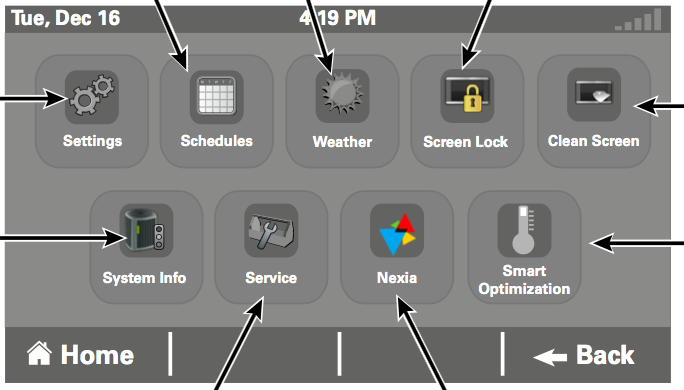

### MyWay

So today I borrowed my friend's computer to do a search because of an issue I had installing the public beta of macOS High Sierra.

I open Safari and get this page:

This ain't Google.

If we look more closely at the whole page, in the upper right-hand corner is:

and the URL displayed is `hp.myway.com`.

After 18 years of using OS X, I finally see an actual living piece of malware.

I immediately **Clear History..** which also dumps any cookies.  Quit Safari and re-launch it and get the exact same thing.

### OnlineMapFinder

#### Extension

Several things have happened to Safari:

* a Safari Extension has been installed called Onlinemapfinder

Safari is helpfully warning me that 

*"OnelineMapFinder" can read, modify, and transmit content from all webpages.  This could include sensitive infromation like passwords, phone numbers and credit cards.*

#### New Homepage

* The preference under General that determines which page is loaded for a new tab or window has been modified to

`http://search.pollicare.com/?...`

That gives us the bogus search window.

But wait, there's more!

#### Persistence

The user's `~/Library/LaunchAgents` directory contains a bunch of malware-related persistence crap, but the `System/Library/LaunchAgents` and `Daemons` have what I would expect.

There are two more applications referenced here:

* Smokyashan
* pronto

#### Application

Finally, and most disturbing, there is an application running which shows the name Pollicare in the Dock 

while its name in the menu shows **ApplR**

The last clue is

A weird looking window from the App that says "An extension is controlling this settings" and then in red, "Delete".

The faulty grammar is an unmistakeable warning.

The app is not installed system-wide:

#### OnlineMapFinder

If you navigate to `www.onlinemapfinder.com` there is a redirect to `http://www.onlinemapfinder.com/index.jhtml`.

Why `jhtml`?

The page looks like this:

So you can imagine how this started.  

On the surface this seems like a standard ploy called [browser hijacking](https://en.wikipedia.org/wiki/Browser_hijacking).  

But the persistence, and the application!, suggest more nefarious activity.

If you clicked on the download, would the bad guys have the ability to write to the user's `LaunchAgents`?  Or place an application on the machine?  I wouldn't think so.

But I'm feeling very happy that my friend is using Safari as a non-administrative user.

#### Application Support

There are also files in `~/Library/Application\ Support`:  `Pollicare`
* ProntoApp
* Smokyashan

And possibly more (iLifeAssetManagement, iLifeMediaBrowser, icdd).

#### Web Search

So what is all this stuff?  We have one app:

* Pollicare

as well as two apps that don't seem to be there but have folders in `~/Library/Application\ Support`:

* ProntoApp
* Smokyashan

The original Safari extension was

* OnlineMapFinder

and the malware family is called

* MyWay

Supposedly, [this](http://download.cnet.com/Pronto-App/3000-31713_4-77095406.html) is a description of what ProntoApp does.

The Publisher's description:

*From Sriram Yadavalli: Pronto is the easiest way to get help around the house from people you trust. Just download the app and you will see services being offered by people you and your friends know. If a few taps you can book your best friend's babysitter or you can have your favorite HomeJoy cleaner come by and clean your house.We will also notify when people who make your life easier are available and can help you. So, next time, your personal shopper is in Whole Foods, we will let you know and you can order your favorite pizza.Pronto is the only service where you can get instant service from people you trust.*

This is the [Smokyashan website](http://www.smokyashan.com/about)

*Install applications the easy way and without the hassle, using the Smokyashan downloader. The Smokyashan platform stems from years of experience with installing applications, resulting in a highly optimized process, yielding faster downloads, a better user experience and more successful installations*

#### Solution

If it were me, I would reinstall the OS from scratch.  But my friend isn't crazy about this.  Since it's a non-admin account, I decided to recommend [Malwarebytes](https://www.malwarebytes.com/pricing/mac/).

I did this mainly based on the quality of the writing on their website, and the testimonials.
