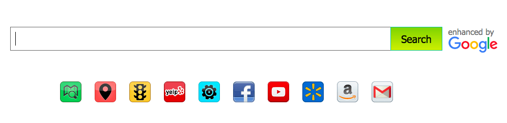
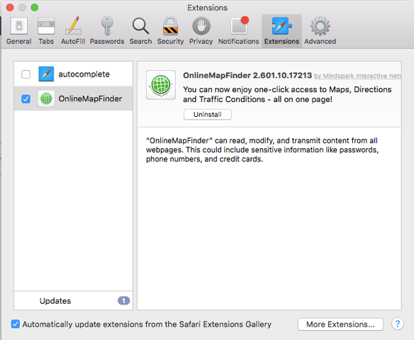
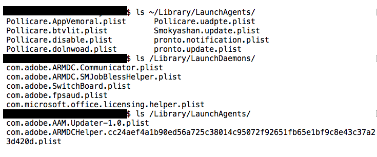
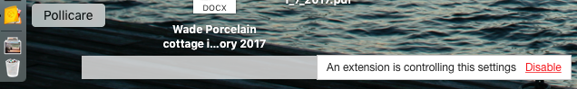
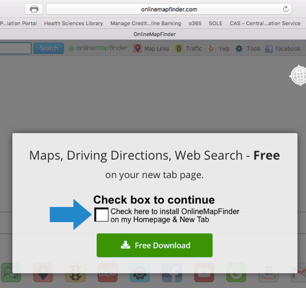
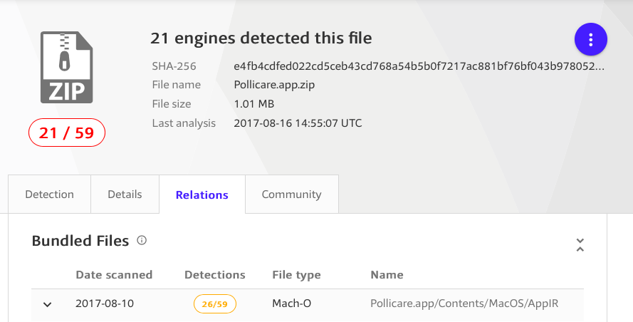

### MyWay *not*

#### Keywords

* OnlineMapFinder
* Pollicare.app
* ProntoApp.app
* Smokyashan.app
* Search.myway

#### Back story

So today I borrowed my friend's computer to do a search because of an issue I had installing the public beta of macOS High Sierra.

I open Safari and get this page:

That isn't Google.

If we look more closely at the whole page, in the upper right-hand corner is:

and the URL displayed is `hp.myway.com`.

After 18 years of using OS X, I finally see an actual piece of malware in the wild.  Pretty exciting.

I immediately **Clear History..** which also dumps any cookies.  Quit Safari and re-launch it and get the exact same thing.

### OnlineMapFinder

#### Extension

Several things have happened to Safari:

* a Safari Extension has been installed called OnlineMapFinder

Safari is helpfully warning me that 

*"OnelineMapFinder" can read, modify, and transmit content from all webpages.  This could include sensitive information like passwords, phone numbers and credit cards.*

#### New Homepage

* The preference under General that determines which page is loaded for a new tab or window has been modified to

`http://search.pollicare.com/?...`

That gives us the bogus search window.

But wait, there's more!

#### Persistence

The user's `~/Library/LaunchAgents` directory contains a bunch of malware-related persistence crap, but the `System/Library/LaunchAgents` and `System/Library/LaunchDaemons` have what I would expect.

(The difference between an agent and a daemon is that a daemon may not have a UI, while an agent may have one if it wishes).

There are two more applications referenced here:

* Smokyashan
* Pronto

#### Application

Finally, and most disturbing, there is an application running which shows the name Pollicare in the Dock 

while its name in the menu shows **AppIR**

The last clue is

A weird looking window from the App that says "An extension is controlling this settings" and then in red, "Delete".

The faulty grammar is an unmistakeable warning.

The app is not installed system-wide:

#### OnlineMapFinder

If you navigate to `www.onlinemapfinder.com` there is a redirect to `http://www.onlinemapfinder.com/index.jhtml`.

Why `jhtml`?  (Java within Hypertext Markup Language).  Good thing we don't allow Java to run in the browser, or indeed anywhere on *this* computer.

The page looks like this:

So you can imagine how this started.  

On the surface this seems like a standard ploy called [browser hijacking](https://en.wikipedia.org/wiki/Browser_hijacking).  

But the persistence, and the installed application!, suggest more nefarious activity.

If you clicked on the download, would the bad guys have the ability to write to the user's `LaunchAgents`?  Or place an application on the machine?  I wouldn't think so.

But I'm feeling very happy that my friend is using Safari as a non-administrative user.

She insists that she doesn't even remember her password and didn't enter it on last July 30, when the plist files below were written.

#### Application Support

There are new folders in `~/Library/Application\ Support`:  

* Pollicare
* ProntoApp
* Smokyashan

Although they are in `Library/Application\ Support`, each folder actually contains an application.  We'll come back to this.  

But first, examine

#### ~/Library/LaunchAgents

I count 8 plist files in `~/Library/LaunchAgents`.  5 of them relate to Pollicare, 2 to ProntoApp and the last to Smokyashan.

The first set launches `Pollicare.app/Contents/MacOS/AppIR` from ``~/Library/Application Support/Pollicare`.  `AppIR` is launched when:

* WatchPaths:   `/Applications/Pollicare/Uninstall Pollicare.app`
* StartCalendarInterval:   Hour 4 Minute 17
* WatchPaths:   `~/Library/Saved Application State/com.apple.Safari.savedState/windows.plist`
* WatchPaths:   `~/Downloads`
* StartCalendarInterval:   Hour 20 Minute 34

So `AppIR` runs when Safari saves its state, whenever there is a download, and whenever the user tries to run `Uninstall Pollicare.app`.  It also runs twice a day at the specified times, and on wake from sleep.

The second set of two launch `ProntoApp.app/Contents/MacOS/ProntoApp` from ``~/Library/Application Support/ProntoApp`.  `ProntoApp` is launched when:

* `RunAtLoad:   true`
* StartCalendarInterval:   Minute 59
* StartCalendarInterval:   Hour 5 Minute 25

`ProtoApp` runs at startup, and every hour at the 59th minute, ect.

Smokyashan:  `Smokyashan.app/Contents/MacOS/AppNOS` runs from `~/Library/Application Support/Smokyashan/` when:

* `RunAtLoad:   true`
* StartCalendarInterval:   Hour 14 Minute 13

on startup and once a day.

#### Applications

I was unable to find anything reliable on the web about how AppIR, ProntoApp and Smokyashan work.

#### Web Search

Supposedly, [this](http://download.cnet.com/Pronto-App/3000-31713_4-77095406.html) is a description of what ProntoApp does.

The Publisher's description:

*From Sriram Yadavalli: Pronto is the easiest way to get help around the house from people you trust. Just download the app and you will see services being offered by people you and your friends know. If a few taps you can book your best friend's babysitter or you can have your favorite HomeJoy cleaner come by and clean your house.We will also notify when people who make your life easier are available and can help you. So, next time, your personal shopper is in Whole Foods, we will let you know and you can order your favorite pizza.Pronto is the only service where you can get instant service from people you trust.*

This is the [Smokyashan website](http://www.smokyashan.com/about)

*Install applications the easy way and without the hassle, using the Smokyashan downloader. The Smokyashan platform stems from years of experience with installing applications, resulting in a highly optimized process, yielding faster downloads, a better user experience and more successful installations*

#### A family of malware

Patrick Wardle has a [write-up](https://objective-see.com/blog/blog_0x20.html) of something that seems very similar to this, though with different names.  His sample, in turn, seems to belong to a family called SafeFinder/OperatorMac by the guys at [malwarebytes](https://www.malwarebytes.com).

#### Solution

If it were me, I would reinstall the OS from scratch.  But my friend isn't crazy about this.  She has old applications like Microsoft Office and Photoshop that she can't easily reinstall.

I am reasonably sure there is nothing installed System-wide.  So my plan is to save all her personal data, delete that account, and make a fresh one.  The reason is that I cannot be sure I've found everything.

She will also have to change all her passwords.

I've never been a fan of antivirus for Macs, but I will also have to look into it.  I like the blog from [Malwarebytes](https://www.malwarebytes.com/pricing/mac/), but it choked when tested against these files.

#### Verification

[VirusTotal](https://www.virustotal.com) 

says about 40% of antivirus programs flag AppIR.app as malware (adware).  MalwareBytes does not!

The ratio is about 30% for ProntoApp.app.

Unfortunately ClamXav didn't do so well.  Even with the latest definitions it found only AppIR.

If I get the time, I will try installing MacOS inside Virtual Box and then see if going to the website (and clicking the box) allows the malware to write outside the Safari sandbox.
