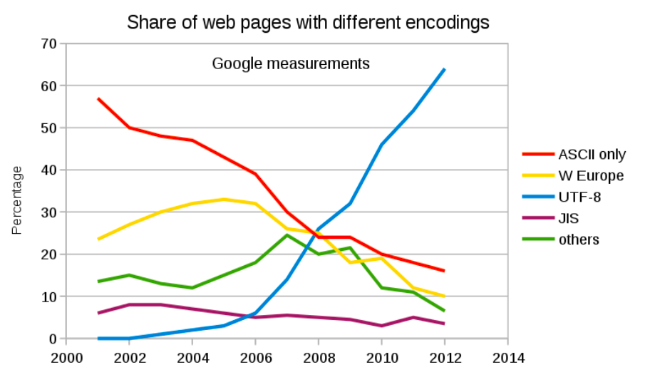

#### Bits and bytes

As you know, everything in the computer is just a bunch of ``0``'s and ``1``'s.  

Every piece of data in a file or in memory, or in a register, is a binary number.  Each digit in the number is called a bit.  A convenient small chunk of data is 8 bits, called a byte.  

The binary number ``01011100`` is one of 256 possible values for a byte (from 0 to 255);  its storage takes 8 bits.

In Python a binary number is identified with a leading ``0b``:  ``0b01011100``. 

Any binary number has a decimal equivalent.  ``0b01011100`` is:

```
0 x 128 + 1 x 64 + 0 x 32 + 1 x 16 + 
1 x   8 + 1 x  4 + 0 x  2 + 0 x  1 =
= 92
```

These two numbers are the same value:

```
0b01011100 (base 2) = 92 (base 10)
```

Base 16 (called hexadecimal) is another convenient representation.  

One byte can be represented by 2 hexdecimal digits.  The hexadecimal digits are (in increasing value) ``0`` to ``9``, followed by ``a`` to ``f``.

```
0000 = 0   0100 = 4   1000 = 8   1100 = c
0001 = 1   0101 = 5   1001 = 9   1101 = d
0010 = 2   0110 = 6   1010 = a   1110 = e
0011 = 3   0111 = 7   1011 = b   1111 = f
```

92 or ``0b01011100`` can also be written as ``5c`` in "hex". 

In Python hexadecimal numbers are identified with a leading ``0x``.

```
0x5c (base 16) = 0b01011100 (base 2) = 92 (base 10)
```

#### Text

Text is represented in the computer, or in transmission on the web, by converting each individual character to a number, and then encoding it.  

In the [original system](http://en.wikipedia.org/wiki/ASCII) the classic programmer's greeting ``Hello world!`` is represented as this list of decimal numbers

```
72 101 108 108 111 32 119 111 114 108 100 33
```

with hex equivalents:

```
48 65 6c 6c 6f 20 77 6f 72 6c 64 21
```

I have a file on my Desktop named ```hello.txt``.  I use a Unix program called ``hexdump`` to look at the contents:

```
> hexdump hello.txt
0000000 48 65 6c 6c 6f 20 77 6f 72 6c 64 21 0a         
000000d
```

The numbers on the left are just a counter for position in the output.  There are 13 (``0d``) bytes in the file.

You can see that the output matches what we had above with the addition of one extra character (``0a)`` at the end.  The reason for that is I put a newline in the file.

#### Newlines

On a Unix system, the newline character is ``0a`` (in hex).  The original designation for this character back in the days of the teletype was ``LF`` (line feed).

Line feed was used to turn the platten, advancing the paper by one line.

In most programming languages, a section of text is called a string.  Within a string the ``LF`` newline character is represented as ``\n``.  

This is a single character, called a control character or escape sequence.  The backslash says that the ``n`` following has a special meaning and is not just a regular n.

Other control characters include:  ``\t`` for tab, and ``\a``, which will make the "bell" ring, on a teletype.

One difference to remember between Windows and Unix systems (like macOS) is that the newline is different.  

The newline control sequence differs between OS's:

```
\r\n   Windows
\n     Unix and macOS
\n\r   Mac (OS 9 and earlier)
```

In binary that ``\r`` is ``0d``.  It's also called ``CR``, carriage return.

Carriage return brought the teletype head back to the beginning of the line.

According to [this](https://stackoverflow.com/questions/1885900/order-of-carriage-return-and-new-line-feed), the order used on teletypes was ``CR LF``.

The reason supposedly is that in the reverse order, there was a chance of having the first character following get printed while the platten was still returning to the left-hand margin.

Note that on very old Mac systems newline was two characters like on Windows, but in reversed order: ``LF CR``.

I've modified ``hello.txt`` to contain a Windows newline:

```
> hexdump hello.mod.txt
0000000 48 65 6c 6c 6f 20 77 6f 72 6c 64 21 0d 0a      
000000e
```

#### ASCII

In the original ASCII encoding system, characters take up exactly one byte, 8 binary zeros and ones.

In addition, all characters 
(including control characters) were of this form in binary:  ``0xxx xxxx``.

The high value bit was unused (this is equivalent to bytes in hexadecimal between ``80`` and ``ff``.

This opportunity led to different OS's and different programmers using the top bit to encode additional characters (Mac OS Roman, Windows 1252, etc.).  

For example, [Mac OS Roman](https://en.wikipedia.org/wiki/Mac_OS_Roman) encodes the square root symbol as ``c3``.

Unfortunately, the solutions were mostly different and incompatible, which was found to be a problem once file exchange became common with the advent of the internet.  Someone with Greek characters couldn't easily exchange a document with another person set up to deal with Cyrillic.

You can see the consequences today when you fetch certain webpages that don't display properly because of an encoding mismatch---the page doesn't properly identify its encoding and the browser guesses wrong.  

The encoding is a settable preference (experiment in your browser).

A bigger problem is that there are many more than 256 characters.  The question of exactly how many Unicode characters or code points there can be, is a bit complicated, but there are a lot of them.  

Every possible character (so far) has a Unicode code point, even the snowman.  Not to mention [this](https://www.fileformat.info/info/unicode/char/1f4a9/index.htm).

Luckily, the standard English letters and other printable characters have the same Unicode code points as in ASCII.

#### Text encoding

Another important feature of text on the computer is encoding.  One could simply use the Unicode values unchanged, so that the first two letters of "Hello world!" would be represented as:

```
00 00 00 48 00 00 00 65
```

This is obviously inefficient, wasteful of memory on the machine and bandwidth on the web.  Various encodings are used to make up for this.  

The most widely used and supported is [UTF-8](https://en.wikipedia.org/wiki/UTF-8).

There is a very nice color diagram in the article that shows how UTF-8 works.  UTF-8 is a "variable width" encoding, which means that some characters may take up to four bytes, but the standard English characters are all the same as in ASCII.

``UTF-8`` has become dominant on the web.



#### How UTF-8 works

The individual bits of each byte in a UTF-8 encoded byte stream can be divided up into metadata digits and informational digits.

```
0xxxxxxx
01xxxxxx
110xxxxx
1110xxxx
11110xxx
```  

Those positions shown with a placeholder ``x`` above are the ones where the actual text information is encoded, and for any particular text they could have any values.

The leading sequences shown as ``110`` and ``1110`` and so on are metadata (formatting).

There are only five types of bytes, those shown above.

If we looked at a byte in isolation, these leading digits are not enough to specify unambiguously which of the five types we're dealing with, since any ``x`` could be either ``0`` or ``1``.

However, we start reading at the beginning of a file, so we know that's the first block of a valid code point.  And knowing that, we can determine which is the last byte of that code point.

Knowing where the first code point ends, of course, allows us to determine the second one correctly, and then the third and so on.

Blocks of format ``01xxxxxx`` are used only for the second and following bytes.  This means there are four possible formattings of a code point:

```
0xxxxxxx
110xxxxx 01xxxxxx
1110xxxx 01xxxxxx 01xxxxxx
11110xxx 01xxxxxx 01xxxxxx 01xxxxxx
```

Suppose we start at the beginning of the file and read ``0xxxxxxx``.  The leading ``0`` indicates that we should read only one byte for the character.  If we had a leading ``110`` we should read a total of two bytes for this Unicode character, and so on.

In the last type

```
11110xxx 01xxxxxx 01xxxxxx 01xxxxxx
```

there are 21 ``x``'s, that's ``2e21`` possible values, or a bit more than 2 million.  This is more than the actual total of Unicode code points, because of further restrictions on what sequences are allowed.

#### UTF-16 encoding

There is also an encoding that you might see called UTF-16, where each code point takes up two bytes or 16 bits.

#### Text editors and word processors

People who are used to Microsoft Office and its program MS Word may call that program a "text editor" but it is more properly known as a "word processor." 

It performs formatting and many other manipulations than just displaying text.  On this page some popular free text editors for Windows are [listed](http://www.lifehack.org/articles/technology/6-powerful-text-editors-for-windows.html).

Windows also comes with Notepad.  On the Mac I have used a variety of editors including TextMate and Smultron, but these days I often just use TextEdit.

In my opinion, you should never use a Word document for bioinformatics, and maybe not for anything, ever.  If I save my ``hello.txt`` file as a Word file, the 14 bytes become 15,360 bytes.  Talk about wasteful!  

There is no guarantee that whichever Word version you are using in ten years will be able to open your current documents.  (Try opening a Word 95 file).

Also, it's not polite to force your colleagues to buy Word just so they can read your data.

If you need formatting (sometimes nice, I admit) try using rich text format or [rtf](http://en.wikipedia.org/wiki/Rich_Text_Format).

rtf is proprietary, but the spec is open and it is widely supported.  It is simple enough that it can be easily parsed and the plain text recovered.

#### Bioinformatics:  FASTA format

A sequence in fasta (originally [``FASTA``](http://en.wikipedia.org/wiki/FASTA_format)) format contains ``>`` as the first character, followed by a title which, technically, runs to the first blank space, followed by a comment, which runs to the first newline.

Starting on the first line is the sequence, which is allowed to have newlines but may not contain blank lines.  Genbank recommends no more than 80 characters per line (the default for some at least is 70).  

The sequence stops either at the first blank line, or at the next ``>``.  

This is valid fasta-formatted data:

```
>S1
ATCG
>S2
ATTG

>S3
TCGA
```

It is not required to have a newline at the end of the file, but some tools will require it, so it's always a good idea to have one.

Sometimes, people will set the file extension to indicate that the file is a fasta file.  Examples:

```
myseq.fasta
myseq.fasta.txt
myseq.fna
myseq.faa
```

Such an extension is not required for most purposes.  It does not determine the format, but may help you to remember which files are fasta files.  It can be used to tell the OS which program to launch when the file is opened.

I suppose I should mention that historically on Windows filenames may not have more than one ``.``.  I am not sure about newer versions.  

I used the dot system a lot (adopted from R syntax), because it makes long names easy to read, but is easier to type than an underscore.  Lately I use hyphens as in ``flask-basic.md``.

#### Dealing with problems

Most text editors nowadays will convert between different newlines and encodings.  Such things can be done on the command line as well.  

I receive a file from a friend with a Windows newline:

```
> hexdump hello-win.txt
0000000 48 65 6c 6c 6f 20 77 6f 72 6c 64 21 0d 0a      
000000e
>
```

We can use the ``tr`` utility to translate the input file ``hello.txt`` by doing the replacement shown and write the result as ``hello.mod.txt``.

```
> tr -d "\r" < hello-win.txt | hexdump
```

```
> hexdump hello-unix.txt
0000000 48 65 6c 6c 6f 20 77 6f 72 6c 64 21 0a         
000000d
>
```

(revised 2018-01-24) 