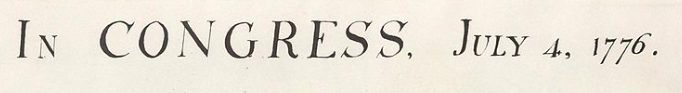

#### Calculate the day of the week

Last night at Team Trivia we were asked the question:  what day of the week was D-Day, June 6, 1944?

```
> cal 6 1944
     June 1944        
Su Mo Tu We Th Fr Sa  
             1  2  3  
 4  5  6  7  8  9 10  
11 12 13 14 15 16 17  
18 19 20 21 22 23 24  
25 26 27 28 29 30     
                      
>
```

We guessed Thursday, which was wrong.

One of our competitors answered this question by computing it.  She knew that Jun 6 this year, 2017, was a Tuesday because that was the last day of school before summer vacation.

If we know the day of the week for any date this year, we can calculate the day of the week for the same date in any other year by computing a &Delta;, as follows.

Since there are 365 days in a standard year, any date this year is one day later than the same date last year, except it is two days later if there is an intervening Feb 29 (leap year).

For intervals shorter than 4 years, one must ask if there is an intervening leap year.  The following assumes the interval is greater than 4 years.

Calculate the the number of years elapsed:

```
2017 - 1944 = 73
```

All day of the week calculations are done with modular arithmetic, mod 7.  

```
73 mod 7 = 3
```

The naive calculation for the number of leap years is to just divide by 4 and discard the remainder:

```
73/4 = 18
18 mod 7 = 4
```

We must also worry about century years (most multiples of 100 are not leap years).  But the year 2000 *was* a leap year, because there is an exception to the century rule when the year is a multiple of 400.

Adding the two results gives

```
(3 + 4) mod 7 = 0
```

The overall &Delta; is zero, which means that both Jun 6, 1944 and Jun 6, 2017 fell on the same day of the week, Tuesday.

#### Additional calculation

Suppose you did not know the day of the week for Jun 6 this year.  

We can also calculate the &Delta; between different dates in the same year.  Yesterday was Wed, Dec 6.  Add up the number of days in excess of 28 (since 28 mod 7 = 0) for the months that end between Jun and Dec:

```
J   J   A   S   O   N
2 + 3 + 3 + 2 + 3 + 2 = 15
15 mod 7 = 1
```

The &Delta; is `1`, which means that Jun 6 is (always) one day of the week earlier than Wed Dec 6, namely, a Tuesday.

#### Alternative

An even simpler approach is possible for the first part of the calculation.  Today is a famous date.  Everyone knows that Dec 7, 1941, was a Sunday.

```
Sun Dec 7, 1941
Thu Dec 7, 2017
```

Now, `Thu(5) - Sun(1) = 4`.

This means that the &Delta; between 1941 and 2017 is 4.

&Delta;<sub>1941-1944</sub> + &Delta;<sub>1944-2017</sub> = &Delta;<sub>1941-2017</sub>

By the calculation above, the right-hand side is 4, and we obtain the desired second term by subtracting the number of years + leap years separating 1941-1944, which is `3 + 1 = 4`. This gives a &Delta; of 0, as we had above.

We still need the day of the week for June 6 of this year.

#### Friend's birthday

Some people know the day of the week when they were born.  I was born on a Monday. 

Our friend Diane was born on June 10, 1944.  If we could ask her, she would have said she was born on a Saturday.  That would have been the easiest method.

#### Lincoln

Abraham Lincoln was shot by John Wilkes Booth on Good Friday, April 14, 1865, and died the next day.

```
2017 - 1865 = 152
152/4 = 38
38 + 152 = 190
190 mod 7 = 1
```

Here the possible leap years include one century year which was not a leap year (1900), so we must subtract 1 for a year &Delta; of 0.

For the within-year calculation we have
15 from above plus 2 for April and and 3 for May = 20.  That gives a total &Delta; of 6.

Therefore, Apr 6, 1865 was 6 days of the week earlier than Wed, Dec 6, 2017.  Thus, it was a Thursday.  That means Apr 13 was a Thursday also, so Apr 14, 1865 was a Friday, which is correct.

#### Fourth of July

The official date for the Declaration of Independence is July 4, 1776.  



Actually, they voted to approve it on this date, it was not signed by all the delegates until about one month later.

```
2017 - 1776 = 241
241/4 = 60
241 + 60 = 301
301 mod 7 = 0
```

However, we must subtract the two century years 1800 and 1900, giving

```
299 mod 7 = 5
```

For the within-year delta:

```
Jul 3
Aug 3
Sep 2
Oct 3
Nov 2
= 13
```

So the total &Delta; is `5 + 13 mod 7 = 4`.

Dec 4, 2017 was a Monday.  Subtracting 4 from that we obtain Thursday, July 4, 1776.

```
> cal 7 1776
     July 1776        
Su Mo Tu We Th Fr Sa  
    1  2  3  4  5  6  
 7  8  9 10 11 12 13  
14 15 16 17 18 19 20  
21 22 23 24 25 26 27  
28 29 30 31           
                      
>
```


 
