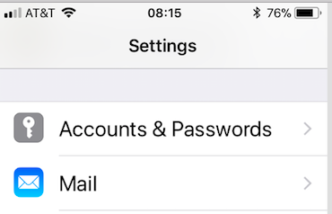
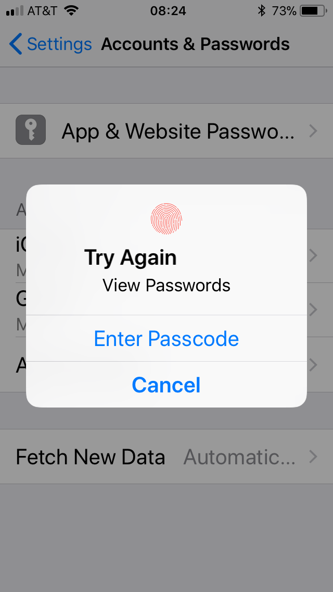
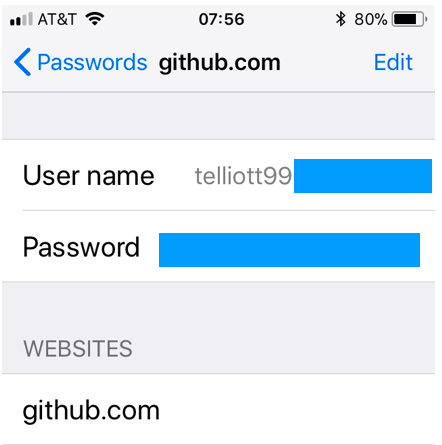
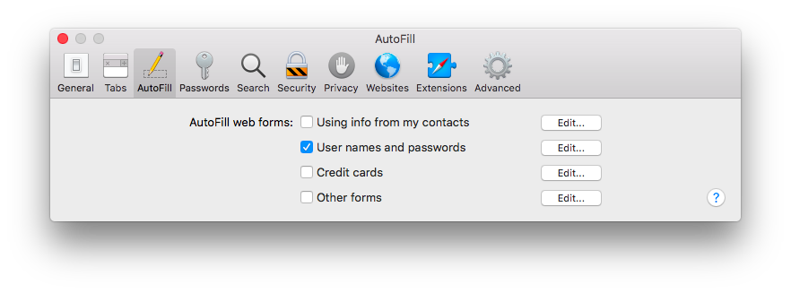
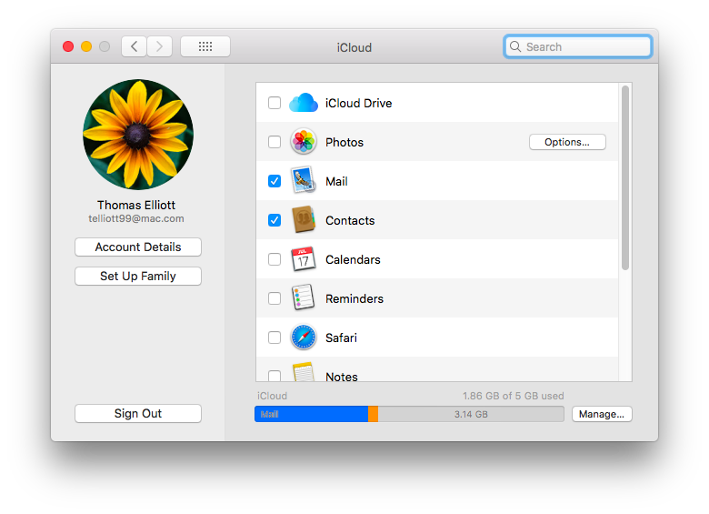
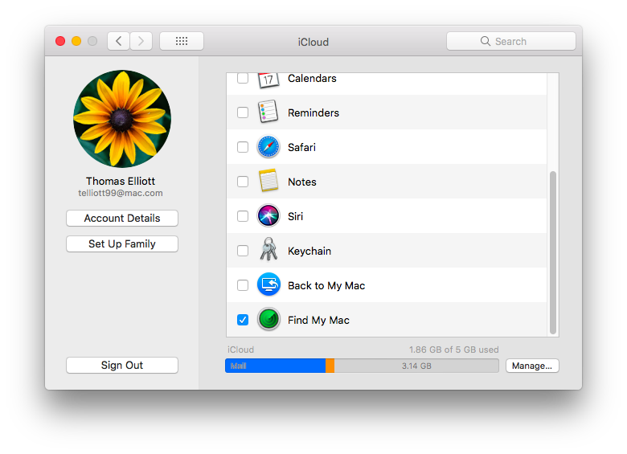
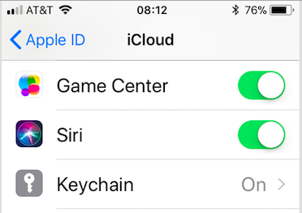

#### iOS security bug / feature

I came across a something unexpected this morning on my iPhone (model MG4X2LL/A, aka iPhone 6).  At first I thought it was a security bug, but I'm wondering now if I just didn't understand iCloud properly.

#### Keychain:  iPhone

Under Settings, in the section with Apple apps, is **Accounts & Passwords**.  I don't recall seeing this before.

If I click on it, I see a screen with **App & Website Passwords**, and if I click on that, it's protected by the 6-digit passcode.

If I enter the passcode successfully, there is a list of websites.

For example, I find **github**.  Clicking on that website gives me:

There is my username and password, in the clear, on my phone.  

I've *never* used Safari to go to github.com on my phone.

#### Keychain:  macOS

I do use the Keychain on macOS (10.3.3 High Sierra) to store usernames and passwords.  

In Safari Preferences, I have checked the appropriate box:  Autofill > User names and passwords.

#### iCloud

What seems to be happening is that iCloud is syncing my passwords to the phone, despite the fact that I have never authorized it to do so.

Here are my iCloud settings:

As the screenshot shows, I have allowed iCloud to sync Mail and Contacts, and Find My Mac is enabled, but the Keychain is not selected.

On the iPhone, under the Apple ID, etc., (the very first item in Settings), I have the Keychain ON.

I don't recall choosing this, but I suppose I must have when I installed iOS 11.3.

#### Summary

The iCloud Keychain is (apparently) on by default in iOS.  

It allows access to passwords stored on my Mac's keychain, even though iCloud Keychain access is explicitly set to OFF on the Mac.

These passwords are visible in plain text on the iPhone's screen, albeit protected by the 6-digit passcode.

I would be freaking out, but luckily I am paranoid enough to do my banking from a completely separate User account on the Mac, and I don't save those passwords to the Keychain anyway.