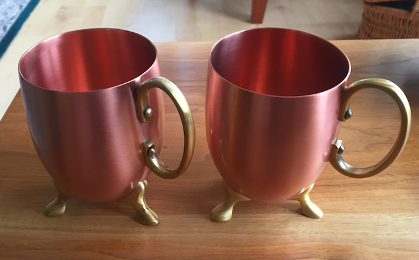

### Moscow mules

We're late to the party, but we started enjoying Moscow mules recently.  A basic mule contains vodka and ginger beer, with a bit of lime.

There seems to be a dispute about whether the drink originated in New York or in Hollywood, but the time was the early 1940's.  What is surprising is that vodka was not yet popular in America, and this was partly an attempt to improve the situation.

For a bit of history, see [wikipedia](https://en.wikipedia.org/wiki/Moscow_mule).  

I use [Rose's](https://en.wikipedia.org/wiki/Rose%27s_lime_juice) lime juice.  

There is more to say about Ginger beer.  First of all, you can't ferment ginger (at least I don't think so), you ferment sugar with added yeast.  Many makers of ginger beer don't bother with tradition, they just mix grain alcohol with ginger extract.

Most ginger beers do not display an alcohol content.  That is not to say there is none.  I read somewhere that a label is only required if the amount exceeds 0.5% (lost it now).  And I read somewhere else that special distillation methods are used to ensure that non-alcoholic beers contain less than 0.05% alcohol.  

So think about that next time you get excited about 2 parts per trillion of some some environmental pollutant.

My favorite ginger beer is [Crabbies](https://en.wikipedia.org/wiki/Crabbie%27s).  It is made by the [traditional method](http://www.scienceinschool.org/2008/issue8/gingerbeer), contains 4.8% alcohol, and has a strong, dark flavor.


#### Copper mugs



According to tradition, a mule is served in a copper cup.  Here is part of the [legend](https://moscowcopper.com/pages/our-story?gclid=EAIaIQobChMIiLf835vF1QIVSUsNCh3iVQEgEAAYASAAEgKH_PD_BwE):

<p style="color:blue">
"In 1941, Sophie Berezinski was a woman on a mission. She had immigrated to the United States from Russia and was carrying a heavy burden: 2,000 solid copper mugs. Sophie’s father owned and operated a copper factory in Russia known as the Moscow Copper Co. Back in Russia, Sophie had created the design for the original copper mug that is now so famously linked to the Moscow Mule cocktail. Her father ran the presses that stamped out 
the mugs.

<p style="color:blue">
The one tool both Sophie and her father lacked was the slick skills of a salesman. Neither Sophie nor her father were able to sell the mugs in Russia, so the decision was made that Sophie and the mugs would journey to America. After all, it was well known that America was the land of opportunity."

Uh huh.

#### Copper bad

Most mugs have a lining so that the copper doesn't contact the drink.  You can tell because the color is silver rather than copper.  It's required for mugs used in bars and restaurants.

I have heard that it's well known that acidic foods cooked in copper can contain high levels of the metal and make you sick (actually Cu<sup>2+</sup>), but I don't have a reference yet.

#### Copper good

Copper is also a micronutrient.  The [RDA for copper](http://lpi.oregonstate.edu/mic/minerals/copper) (adults) is 900 &mu;g per day, and the "safe" level for drinking water is 2 mg (WHO) or 1.3 mg (EPA) per liter.  

[OTOH, should one of us prove to have an undiagnosed genetic disorder affecting copper storage, the safe level might be much less! ]

One study cited on the page above had subjects ingest 8 mg per day for 147 days without significant damage (including to the liver).  However, those people did accumulate copper, so this is likely too much for the long term.

#### Copper and acid

The question is what happens at pH 3 or so during 15 min at a temperature of 0&deg; C.

We could do some [chemistry](http://www.chemguide.co.uk/inorganic/transition/copper.html).

I found a really old [paper](http://www.nrcresearchpress.com/doi/pdf/10.1139/v54-022) (*The rate of dissolution of copper*) that reports some experiments of interest.  (There are others, but they're pay-walled.  I hate you, Elsevier).

The setup was to use a machined copper bar, rotated in a bath of sulfuric acid at pH 1.  After 5 hours of reaction at 25°C, a 10.8 cm<sup>2</sup> copper bar gave up 500 mL of 10<sup>-4</sup> M Cu<sup>2+</sup>.  That is about 32 mg (Cu MW = 63.5 g/mole).

Of course, we're not drinking sulfuric acid.

The rate

* roughly doubles for every 10°C (within a narrow range)
* is linear with time
* is linear with O<sub>2</sub> pressure

The pH dependence is unfortunately not reported in detail, but my reading of Fig 13 gives at least a factor of 10 decrease from pH 1 to pH 3.

So, adjusting for temperature and pH, as a rough guess I would expect this much surface area to give something like 0.8 mg of copper dissolved (32/40).

The cups have a height of 4 cm and diameter of about pi cm (curiously enough).  We approximate the surface as a cylinder of height 2.5 cm plus a hemisphere of radius pi / 2.  The cylinder has the same radius. 

The surface area of the cylinder is height x circumference

``` 
= 2.5 x 2 x pi x (pi/2) = 2.5 pi^2
```

and the hemisphere is 1/2 x 4 x pi x radius squared:

```
1/2 x 4 x pi x (pi/2)^2 = 0.5 pi^2
```

I get about about 30 cm<sup>2</sup>, so that should increase our values by a factor of 3.

#### Experiment

Since mg levels are reasonably safe, I thought we would just weigh the mugs as we drink from them over a period of time.

We obtained 4 mugs Caldey Moscow Mule Mug(s). I'm not sure of the vendor, but here is one [page](https://www.anthropologie.com/shop/caldey-moscow-mule-mug).  

They are advertised as pure copper and have no obvious lining (though they might have a coating we don't detect---they don't seem to be oxidizing).

The plan is to see if **the weight changes** during extended use.  

Luckily I still have my Sartorius balance.  (Not the fancy one, but the readout does go to 1 mg).

The problem is how to tell the 4 mugs apart.  I weighed each one:

    2017-Aug-6
    #1 276.209
    #2 280.266
    #3 285.094 (h = mark on handle)
    #4 277.126 (f = slightly damaged foot)

We used `f` and `h` and one of the others (not sure which) to make a Mule on 8-6.

I washed and dried them afterward (obviously, this is important to get an accurate weight).  We're not worrying about oils from fingers, etc.  That would only matter if we had microgram accuracy.

The next day (8-7-2017), I weighed the two "marked" ones again:

    2017-Aug-7
    285.097 h
    280.268 f

Two conclusions:  the damaged foot isn't obvious enough because the one I thought was `f` today is clearly `#2` from yesterday.  

Second, we're probably not losing 10 mg per day.  So we can safely let the experiment run for a while.

#### (Almost) one week later

Unfortunately, I was unable convince the gang to keep accurate records of which cups had how many mules made, but I have one cup that was unused (u), the others had roughly one mule per day.  

I matched them up with the previous numbering system by the gram weights:

    2017-Aug-12
    #1 276.226 (u)
    #2 280.280
    #3 285.109 (h)
    #4 277.191

Compared to the initial values

    2017-Aug-6
    #1 276.209
    #2 280.266
    #3 285.094 (h)
    #4 277.126

we see a problem:  we're *gaining* weight.

The &Delta;s

    #1 + 0.015 (u)
    #2 + 0.014
    #3 + 0.015 (h)
    #4 + 0.065

I dry them gently for 15 min on low in the warming oven, then cool for 15 min at RT.

2017-Aug-12 (2nd weighing)

weight with &Delta;
    
    #1 276.213 + 0.004 (u)
    #2 280.273 + 0.007
    #3 285.102 + 0.008 (h)
    #4 277.188 + 0.062

I can't really explain the gain of 62 mg by #4.  However, the others don't seem to have changed much.

For the next cycle, we'll use only #2 and #3 to make mules.  Then we'll do 

* wash
* dry ON
* dry for 15 min on low in the warming oven
* cool for 15 min at RT

#### Continuing the experiment

From a technical point of view, I'm running into all kinds of problems.  The technician has introduced some additional variables, she

* makes mules *without* Vodka
* makes mules with different brands of ginger beer
* doesn't always use the same cup
* puts a half-finished non-alcoholic mule in the fridge ON

We continue.

As people have said to me, yeah I know it's a lousy experiment, but *it's the only experiment I can do*.  I used to be unsympathetic.

2017-Aug-22 weight (&Delta;)
    
    #1 276.222 (+ 0.012) (u)
    #2 280.280 (+ 0.014)
    #3 285.109 (+ 0.015) (h)
    #4 277.189 (+ 0.063)

and again, #2 and #3 are the ones being used.  #4 changed very little from the previous weight, I must have just screwed up in the initial setup.

