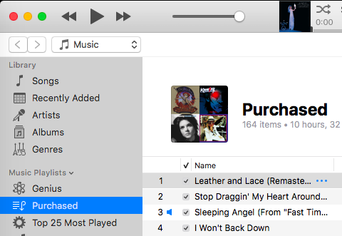
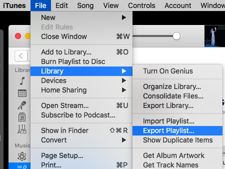
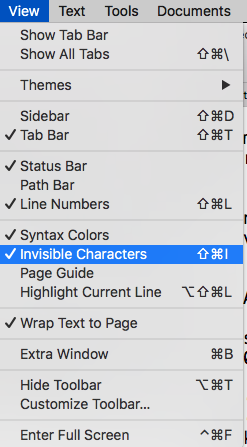
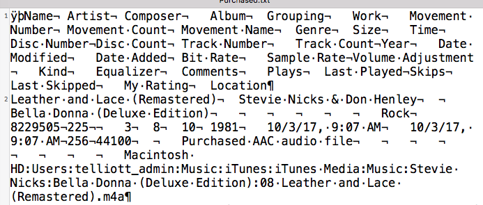

#### Exporting a playlist

So I've bought a couple hundred songs from the iTunes store over the last few years, and I wanted to archive them on a hard drive.  I don't use iCloud.

It's pretty easy to export the corresponding playlist.  Just select "Purchased" in the sidebar



and then do "Export"



The resulting file looks pretty normal, except for the large number of tab-separated fields





#### Dealing with UTF-16

There are peculiarities:

```
> hexdump -n 32 -C Purchased.txt
00000000  ff fe 4e 00 61 00 6d 00  65 00 09 00 41 00 72 00  |..N.a.m.e...A.r.|
00000010  74 00 69 00 73 00 74 00  09 00 43 00 6f 00 6d 00  |t.i.s.t...C.o.m.|
00000020
>
```

- The first two bytes are `ff fe`
- the data is UTF-16
- use of `\r` for newlines

Seeing `ff fe` as the byte order mark (BOM) indicates that the data is little-endian, which is confirmed by pairs of ASCII + `\x00`, with the least significant byte first. 

Hence, the next bytes are 

```
4e 00 61 00 6d 00 65
```

i.e., 'Name' in little-endian UTF-16 format.

A third issue is the use of `\r`, hex `\x0d`, alone, for newlines as seen in this part of the hexdump:

```
00000250  69 00 6f 00 6e 00 0d 00  4c 00 65 00 61 00 74 00  |i.o.n...L.e.a.t.|
```

This is a dinosaur from pre-OS X days in the mid-1990s.

Python loads the data as single bytes.  If we split the data on the correct newline and print a single entry, we get text.  But if we print a slice like `print L[:2]`

we get

```
['\x00L\x00e\x00a\x00t\x00h ...
```

Interim solution:

- read the data from the file as bytes
- remove the first two bytes
- then remove the even numbered ones
- split on `\r`

#### Deal with each entry 

There are a lot of fields, luckily the path is the last one.  Additionally, the path is weird, because the filename components contain spaces (which is no big deal), but the path separator is ':' and there is a leading 'Macintosh HD'.  

Another issue is that I'd like to preserve the directory structure:  'Artist/Album/Song'.  

You can see how all this is done in the [script](script.py).

