**TL;DR**

We got new heat pumps and new thermostats at our house in Folly Beach (8-1-2017).  This is a quick overview of the essentials from the thermostat manual.

#### New AC

The immediate cause was this engineering failure:

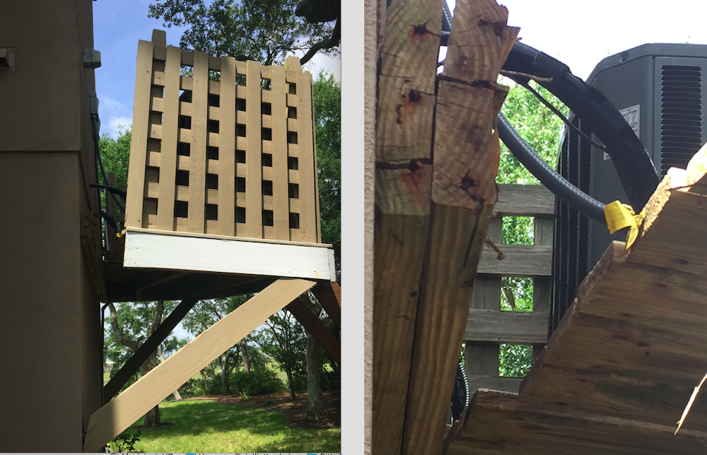

We obviously needed a new stand, and decided to replace the 11-year-old units.  The heat pumps themselves were not too bad, but the coils were in rough shape.

We had everything installed by Jeremy Manchester's company [PleasantAC](http://www.pleasantac.com).

He's a wonderful guy and we recommend him and his company highly.  If you live in Charleston, SC, or Clearwater, FL, you should check him out.

#### Setting the Trane Thermostat

The point of the write-up is to provide an overview of programming the new thermostats.

These are:

* Trane XL824 Smart Control

while they are not connected to WiFi and the internet, they *could* be.  The manufacturer would like us to subscribe to their special **Nexia Home Intelligence** service and I'm not interested in that.

It isn't clear from the manual whether you could just hook them up to the LAN and access them locally.  I'll try that soon and report back.

#### Quickies

This is the home screen from the manual

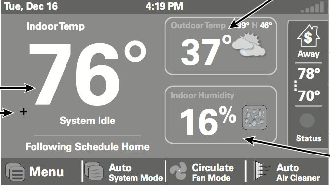

**brightness**

Before I could do anything else, I needed to change the screen brightness to 100% so I could actually see it.  I had to read the manual to find out how to do this since I could not actually read the screen at 60% brightness.

* Press Home > Menu

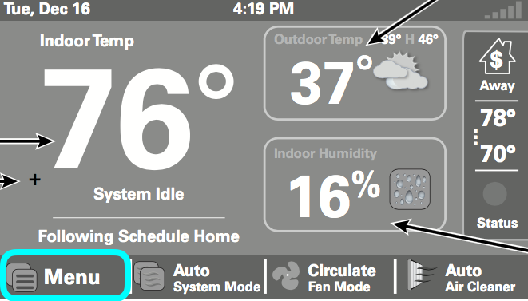

* Press Menu > Settings

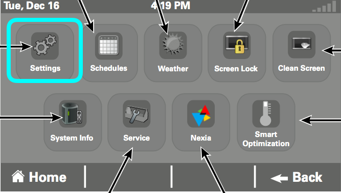

* Press Settings > Display

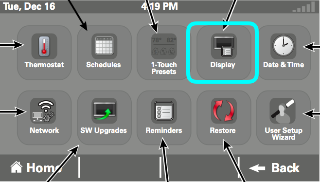

and follow the on-screen prompt.

**Quick temp change**

The set temperature can be changed quickly, by pressing in the middle of the right-hand side.

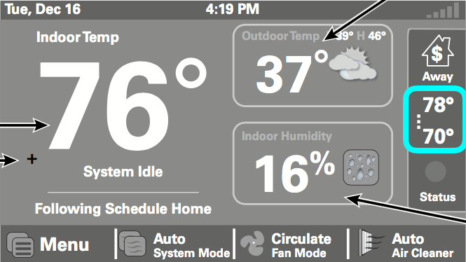

If scheduling is enabled (see below), then this changes only the current period.  If 1-Touch is enabled (again, below), then this change may or may not be associated with one of the 1-Touch settings (I know, it's confusing).  Nevertheless, this is a good way to make a quick, temporary adjustment.

**system off/on**

If you want to turn the unit off quickly, press System Mode on the home screen (next to Menu) and toggle the button.  The system in the figure below is set to **Auto** (heat or cool, whatever is necessary).

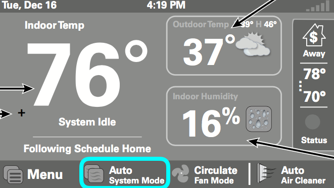

**screen lock**

If the screen is locked, the super-duper secret unlocking method is to press **Menu** on the home screen for 5 seconds, which will do a temporary unlock and allow you to change the setting.

Screen lock set and unset is done from the menu screen.

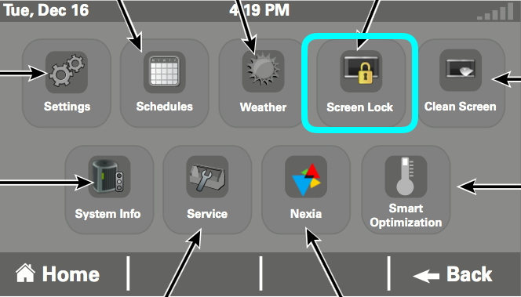

And then finally, note that when starting up the system, the temperature reported (76 in large digits on the left)

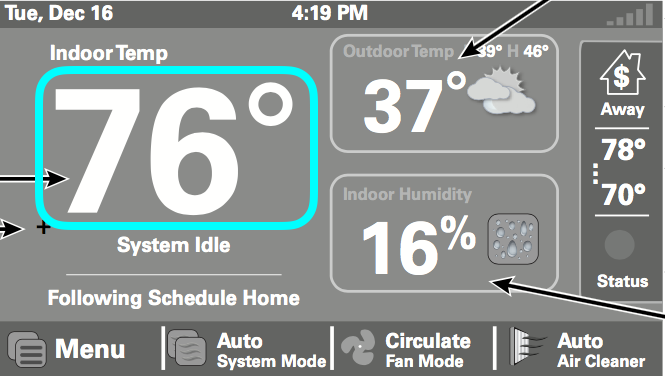

will likely be off by a few degrees (low), for an hour or so.

#### Two modes

There are two standard modes for controlling the unit:  a basic mode called **1-Touch** and an advanced mode called **Scheduling**.

On the main screen the actual indoor temperature is displayed in large digits on the left.  Below it appears one of  **Cooling** or **System Idle** or **System Off**, etc.

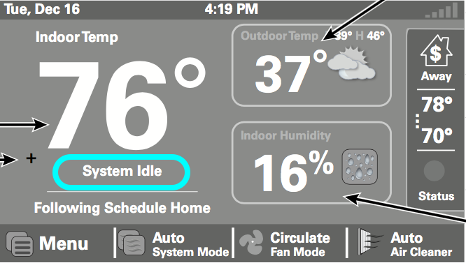

Next below that (just above **Menu**) is a description of which one of these modes is in use, e.g. **Scheduling disabled** or **Following Schedule X**.

Below that are four buttons that bring up additional screens:  **Menu**, **System Mode**, **Fan Mode**, and **Air Cleaner**.  

To change whether scheduling is enabled, do

*  Menu > Settings 

and toggle the **Schedules** button.

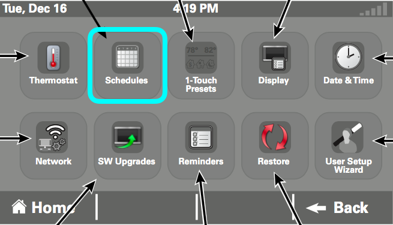

Now go **Back** to **Menu**.  

In the manual, the **Menu** screen also has a button titled **Schedules**.  

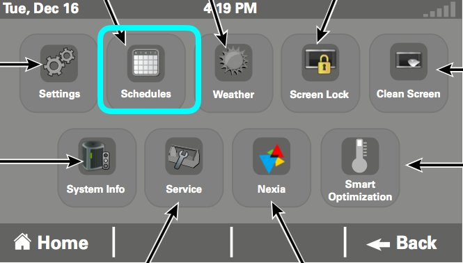

But on the actual control I have, if scheduling is off and we're in 1-Touch mode, this button says **1-Touch Presets**, which makes sense.

If scheduling is enabled, the button says **Schedules**, and pressing it leads to a screen for laying out custom schedules.  

You should look at the manual for instructions on how to do that.  It's pretty straightforward.

**1-Touch Presets**, which is a version of the Temperature Control Panel, can also be reached from the home screen by pressing in the Indoor Temperature area on the left. Press the number "76" on the home screen in this example.

The display shown below for Temperature Control Panel is the one seen when in **1-Touch** mode (the one for when scheduling is enabled is different).

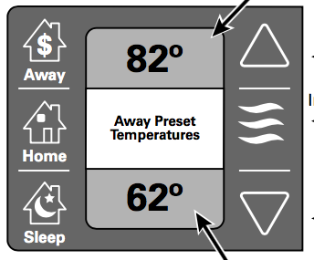

Toggle "Away" etc. to select which temperature setting you want to change.  A second selection is the value.  The top temperature setting is for cooling and the bottom for heating. 

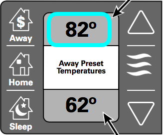 

The arrows on the right change the values.  The wavy blue icon indicates cooling (i.e. the top value is selected, so we're editing the set point for cooling).

Back on the home screen, in the upper right-hand corner is an icon that says **Away** 

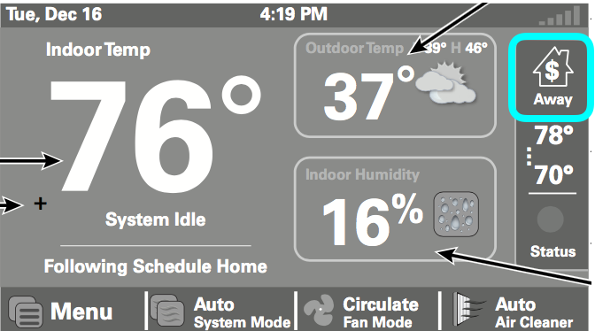

I had trouble understanding this at first, because **Away** is *always* visible on the home screen, but it is much brighter when "Away" mode is actually selected.

Toggling this button to **Away** on the home screen *overrides scheduling*.

So rather than turn scheduling off entirely, we might have just activated **Away** by hitting this button, and if the temperature had been set lower than ambient (it is set to 85 with the factory default), then the unit would cool as we want.

If scheduling is active, then the temperature control screen changes

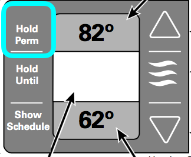

Thus, another way to maintain the current settings indefinitely, with scheduling active, would be to select **Hold Perm**.  However, the default is to only **Hold Until** the next scheduled period begins.  

This is why our brand-new unit switched off automatically at 6 in the morning.

**Optimization**

One potential complication is a feature called Smart Optimization, which is on by default.  On the Menu screen

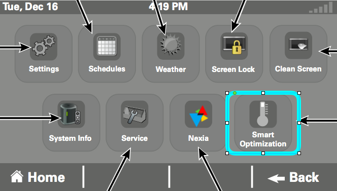

This shuts down the system for 90 minutes after it has been up for 18 hours.  I turned it off.  I guess the idea is that the thermostat would monitor the rate at which the temperature rises with the unit off.